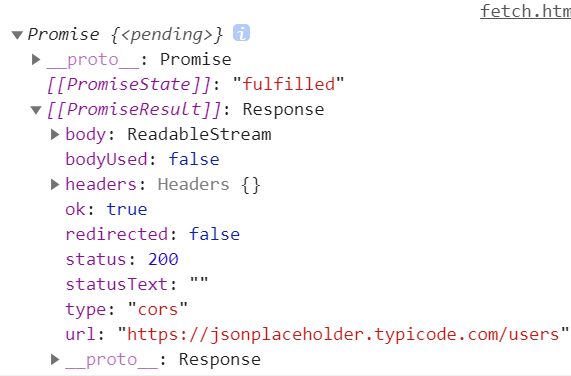

fetch是JavaScript原生的api，主要用于网络请求
fetch 向服务器端发送http请求，在不刷新网页的前提下，可以实现局部刷新页面内容

基本语法 `fetch(url,[options]`
他的返回值为promise
```js
    let res = fetch('https://jsonplaceholder.typicode.com/users')//不写options默认为get
    console.log(res)//promise对象
```

