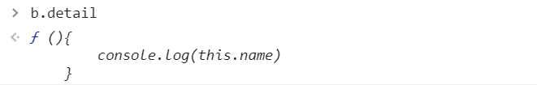

## this的值

this的值是在**函数执行**时决定的

默认的情况下`this`指向的是window
构造函数中会指向实例对象
对象方法中指向所属对象

看几个例子
```js
var name = 'Harry'
function special(){
    console.log(this.name)
}
var girl = {
    name:'Ruby',
    info:function(){
        console.log(this.name)
    },
    woman:{
        name:'Mary',
        info:function(){
            console.log(this.name)
        }
    },
    special:special
}
girl.info()//Ruby
girl.woman.info()//Mary
girl.special()//Ruby
```
通过对象方法中this指向所属对象
很容易得到`girl.info()`和`girl.woman.info()`的值  
`girl.special()`方法会调用全局下的`special`函数，但是*this的值是在**函数执行**时决定的*，所以此处的this指向的是girl对象所以输出Ruby

```js
var name = 'Maeve'
function a(){
    var name = 'Ruby'
    console.log(this.name)
}
function d(i){
    return i()
}
var b = {
    name:'Otis',
    detail:function(){
        console.log(this.name)
    },
    other:function(){
        return function(){
            console.log(this.name)
        }
    }
}
var c = b.detail;
b.a = a;
var e = b.other()
a();//Maeve
c();//Maeve
b.a();//Otis
d(b.detail);//Maeve
e()//Maeve
```
1. `a()`执行全局下的a函数，此时this默认指向window-->window.name 为 Maeve 故输出 Maeve  
2. `c()`：`var c = b.detail`相当于函数声明将b.detail赋给c  
  
`c()`函数执行，此时在全局环境下，所以this指向的还是window 输出 Maeve   
3. `b.a()`,由`b.a = a`知，b被添加一个a属性，并把函数a赋值给这个属性，所以此时this会指向所属的对象b，输出 Otis  
4. `d(b.detail)` 函数d接收一个参数，并返回参数执行的值，b.detail被作为参数传递给函数  
  
此时在全局环境下执行 this指向 window 输出 Maeve
5. `e()` 此时是把 `b.other()` 赋给 e 而不是`b.other`  
为参数传递给函数  
.png) 
`e()`函数执行，此时在全局环境下，所以this指向的还是window 输出 Maeve 

## 改变this的指向
想要改变this的执行，一般可以通过`call`、`apply`和`bind`来完成
bind方法相对于前两种方法，他不会调用函数

