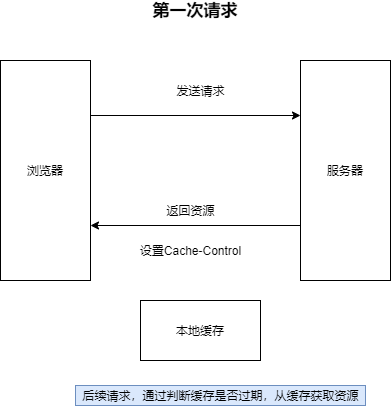

减少网络请求的体积和数量

## 强制缓存
强制缓存可以通过设置 `Expires`和`Cache-Contorl`来实现；表示在缓存期间不需要请求，状态码为200

**Expires**
表示资源在某个时间后会过期，需要再次请求，Expires 受限于本地时间，修改本地时间可能会造成缓存失效

**Cache-Control**
Cache-Control:max-age=30(30秒后过期)
优先于expires,过期后需要再次请求；
Cache-Control可以在请求头或者响应头中设置，并且结合使用多种指令
获取不希望缓存可以设置为no-cache

## 协商缓存（对比缓存）
是一种服务端的缓存策略，可以通过设置`Last-Modified`和`ETag`实现  

**Last-Modified**

表示本地文件最后修改的日期
`If-Modified-Since`会`Last-Modified`的值发送给服务器，询问服务器资源在时间后是否更新，有就发送新的资源，无就返回304

**ETag**

资源对应的唯一字符串
优先级高于`Last-Modified`
`If-None-Match`会将`ETag`发送给服务器，询问该资源`ETag`是否变动，有变动的话就将新的资源发送回来

**两者的比较**

`Last-Modified`只能精确到秒，如在更为精确的时间内修改了文件，就无法返回正确的资源
如果在本地打开文件，即使没有修改，也会造成`Last-Modified`的改变，但是`ETag`可以判断文件内容是否相同

大致流程图 

