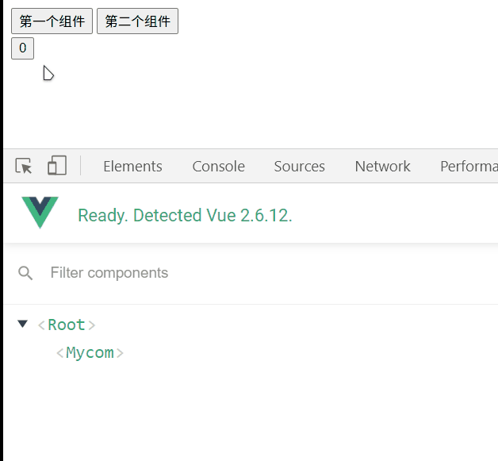
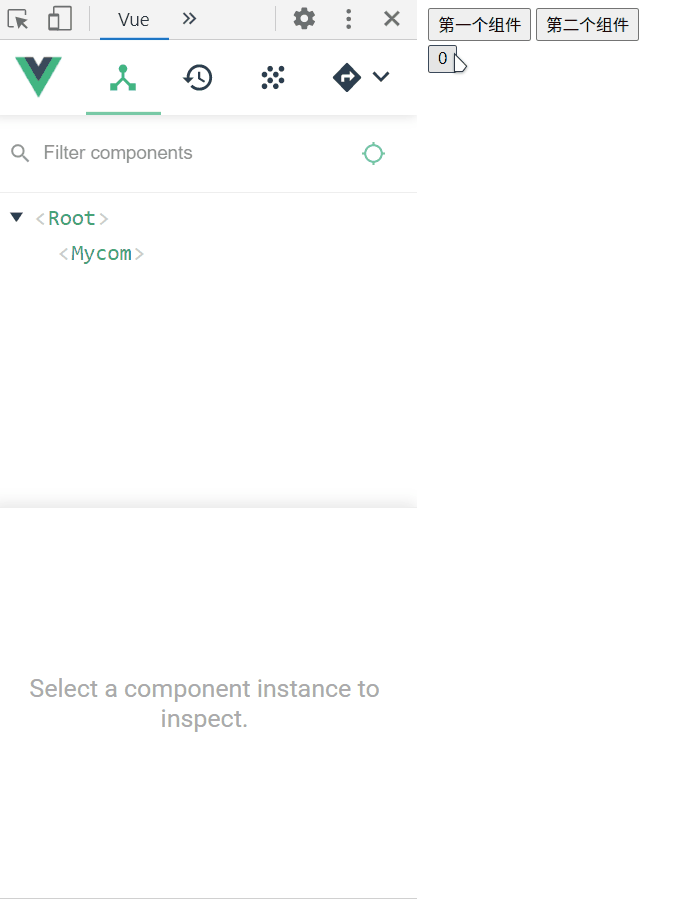

当在使用`<componet>`时可以通过`is`来切换不同组件但无法保存组件的状态

这里简单写了两个组件,模拟切换组件时，组件的状态无法保存

```html
<!DOCTYPE html>
<html lang="en">
	<head>
		<meta charset="UTF-8" />
		<title>Document</title>
	</head>

	<body>
		<div id="app">
			<div>
                <button @click="myCom()">第一个组件</button>
                <button @click="otherCom()">第二个组件</button>
            </div>
			<component :is="comName"></component>
		</div>
	</body>
	<script src="../js/vue2.6.12.js"></script>
	<script>
		Vue.component('Mycom', {
			data: function () {
				return {
					count: 0,
				}
			},
			template: `<button @click='count++'>{{count}}</button>`,
		})
		Vue.component('Othercom', {
			data: function () {
				return {
					msg: '',
				}
			},
			template: `<div><button @click='show()'>点击</button>{{msg}}</div>`,
			methods: {
				show() {
					this.msg = '我是另一个组件'
				},
			},
		})
		var app = new Vue({
			el: '#app',
			data: {
				comName: 'Mycom',
			},
			methods: {
				myCom() {
					this.comName = 'Mycom'
				},
				otherCom() {
					this.comName = 'Othercom'
				},
			},
		})
	</script>
</html>
```  
  
由图可知，当切换组件时，原有的组件被销毁了，重新切换回来时又被创建了，所以原有的状态无法保存下来  

但是通过`keep-alive`可以将组件的状态缓存下来

```html
    <keep-alive>
        <component :is="comName"></component>
    </keep-alive>
```  
  

通过图可发现被切换掉的组件后面会有一个`inactive`的标志，表示失活  
当该标签的内的组件被切换，`activated`和`deactivated`两个生命周期函数会被执行  
当组件**被缓存**时会触发`deactivated`，当**被激活**会触发`activated`  

此外，`<keep-alive>`是一个抽象组件：它自身不会渲染一个 DOM 元素，也不会出现在组件的父组件链中。  

它涉及三个属性分别是`include`、`exclude`和`max`

`include`和`exclude`表示有条件的缓存，条件可以用字符串或者正则表示，可以用逗号进行分隔
- `include`表示只有名字匹配的才会被缓存
- `exclude`表示名字匹配的组件都不会被缓存  
```html
	<!--通过逗号分隔-->
    <keep-alive include='Mycom,Othercom'>
        <component :is="comName"></component>
    </keep-alive>
```  
`max`表示可以被缓存的数量，一般用数字表示

[参考链接](https://cn.vuejs.org/v2/api/#keep-alive)